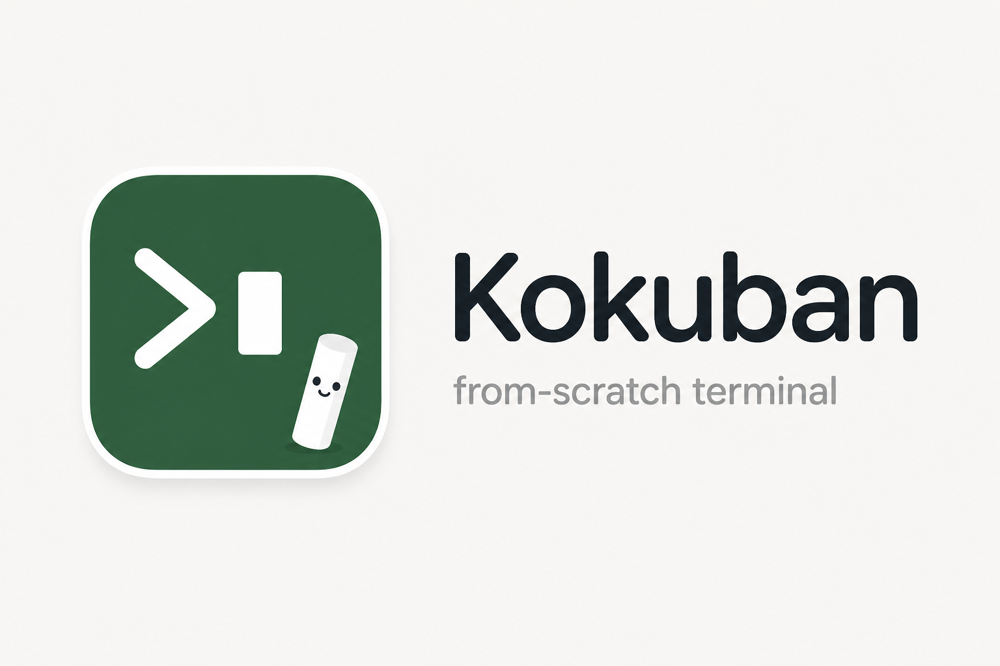

# 黒板 Kokuban

A native GPU terminal emulator built from scratch in Rust.




Kokuban is a from-scratch terminal emulator with a Metal GPU renderer on macOS and a software rasterizer on Linux. It includes its own VT/ANSI parser, PTY handling, glyph rendering, pane management, and graphics protocol support.

An Ubuntu/Xvfb release run measured a 7.98 MiB executable and 11.93 MiB idle RSS. A short 320×180 video test observed all 72 source frames with 8.75% of one CPU core used by Kokuban. These are bounded CI scenarios, not hardware-independent guarantees; see the [resource measurements and reproduction steps](docs/LINUX_PERFORMANCE.md).

## Features

- **Native rendering**: Metal GPU renderer on macOS; software rasterizer with winit + softbuffer on Linux
- **Built-in parser**: VT/ANSI escape sequence parser with support for complex SGR modes (faint, conceal, styled underlines)
- **Graphics protocols**: Static Kitty PNG/RGB/RGBA images and Sixel on macOS and Linux; Linux also supports native Kitty animation with a bounded CPU cache
- **Pane management (macOS)**: Split windows vertically or horizontally, navigate with vim-style keybinds
- **Zoom (macOS)**: Dynamic font size adjustment per session
- **Selection and clipboard**: Mouse-driven selection on macOS and Linux; Linux copy/paste shortcuts with an asynchronous system clipboard
- **Status bar (macOS)**: Shows shell, working directory, and pane index
- **Prompt marks (macOS)**: Visual indicators for command boundaries with navigation shortcuts
- **Configuration**: TOML-based config file with font, color, and keybind customization

## Platform Support

- **macOS**: Metal GPU renderer (11.0+)
- **Linux**: Software rasterizer with X11/Wayland via winit

Android APK builds and emulator validation are being developed on the separate `codex/android-native` branch; Android is not yet integrated into `main`. Windows is not supported. The crate will fail to compile on unsupported platforms. See the [delivery roadmap](docs/ROADMAP.md), [Android integration handoff](docs/ANDROID_SHARED_INTEGRATION.md) and [second-session prompt](docs/SECOND_SESSION_PROMPT.md) for the remaining work and evidence.

## Installation

### Prerequisites

**Linux** requires:
- libfontconfig
- libfreetype6
- libxkbcommon-x11-0
- X11 or Wayland display server

On Debian/Ubuntu:
```bash
sudo apt install libfontconfig1-dev libfreetype6-dev libxkbcommon-x11-0
```

**macOS** has no additional dependencies beyond Xcode Command Line Tools.

### Building from Source

```bash
# Clone the repository
git clone https://github.com/guicybercode/kokuban.rs.git
cd kokuban.rs

# Build release binary
cargo build --release

# Run
./target/release/kokuban
```

The binary will be created at `target/release/kokuban`.

### Trying images

Run these commands **inside a Kokuban terminal**, from the repository directory:

```bash
cargo run --example graphics -- kitty
cargo run --example graphics -- sixel
cargo run --example graphics -- /path/to/photo.png
cargo run --example graphics -- stream
cargo run --example graphics -- animate  # Linux
```

The Rust example sends PNG images in Kitty chunks or a Sixel color pattern. `stream` replaces the same image for 120 frames with a requested rate of 30 FPS. `animate` uploads 30 frames and exits; Linux continues playback for three loops using Kitty animation controls. These examples are not performance benchmarks. Linux also plays video through external mpv's direct Kitty output; a 320×180 lossless clip, pause/resume and all 72 visible frames passed the [real-player test](docs/LINUX_VIDEO.md). Audio and sustained playback remain unverified. The macOS renderer returns `ENOTSUP` for animation commands.

Images follow terminal scrolling. Image placements crossing a partial scroll region are discarded to avoid painting over fixed text. The Linux cache limits decoded bytes, image count (4096), retained frames across the cache (4096), and frames per image (256). Animation frames use complete RGBA canvases, including delta uploads, and count against the byte limit. Snapshots share pixel buffers, so concurrent upload and rendering can temporarily retain more memory than the cache limit. Hidden animations schedule no timer and catch up when visible again. See the [shared animation contract](docs/ANIMATION.md). Configuration applies at startup:

```toml
[images]
enabled = true
max_memory_mb = 64
kitty_enabled = true
sixel_enabled = true

[images.kitty]
max_image_size_mb = 16
allow_file_transfer = false
```

These are example limits; defaults remain 256 MiB for the cache and 50 MiB per Kitty upload. `allow_file_transfer = false` keeps transfers in the terminal byte stream, including over SSH. Set `images.enabled = false` to disable both image protocols. Kokuban starts the shell configured through `KOKUBAN_SHELL` or `SHELL`; SSH on Linux runs through the system's `ssh` command in that shell.

## Configuration

Kokuban reads its configuration from `kokuban.toml` in the current working directory or `~/.config/kokuban/kokuban.toml`. A default configuration will be used if no file is found.

Example configuration:

```toml
[font]
family = "Menlo"
size = 14.0
zoom_step = 1.0

[window]
columns = 80
rows = 24
opacity = 1.0

[colors]
foreground = "#c0c0c0"
background = "#1a1a2e"

[selection]
foreground = "#000000"
background = "#b4d5fe"

[status_bar]
enabled = true
show_shell = true
show_cwd = true

[prompt_marks]
enabled = true
show_indicator = true
indicator_color = "#b5312c"

[keybind]
split_vertical = "cmd+d"
split_horizontal = "cmd+shift+d"
close_pane = "cmd+w"
focus_left = "cmd+h"
focus_down = "cmd+j"
focus_up = "cmd+k"
focus_right = "cmd+l"
zoom_in = "cmd+="
zoom_out = "cmd+-"
zoom_reset = "cmd+0"
```

See `kokuban.toml` in the repository root for the complete default configuration.

## Keybinds

Linux supports these clipboard and selection actions:

| Action | Linux input |
|--------|-------------|
| Select text | Left-button drag |
| Select text while an application captures the mouse | `Shift` + left-button drag |
| Copy selection | `Ctrl+Shift+C` |
| Paste clipboard | `Ctrl+Shift+V` or `Shift+Insert` |
| Select all retained text | `Ctrl+Shift+A` |

Ordinary `Ctrl+C` and `Ctrl+V` remain application input. Paste honors bracketed-paste mode, normalizes line endings, removes embedded control characters, and rejects oversized text instead of truncating it. Copy and encoded paste are limited to 1 MiB. Clipboard access runs in the background; accepted repeated paste requests retain their order.

The Linux clipboard works through X11 or a Wayland compositor exposing a data-control protocol. Other Wayland desktops need XWayland clipboard access. Copy currently inserts line breaks between physical terminal rows; soft-wrap reconstruction and OSC 52 remote clipboard commands remain pending. See [Linux application validation](docs/LINUX_APPS.md).

These pane, zoom and prompt-navigation keybinds currently apply to macOS. Linux provides terminal keyboard/IME and mouse input and scrollback; it does not yet implement this pane shortcut table.

| Action              | Keybind             |
|---------------------|---------------------|
| Split vertical      | `Cmd+D`             |
| Split horizontal    | `Cmd+Shift+D`       |
| Close pane          | `Cmd+W`             |
| Focus left pane     | `Cmd+H`             |
| Focus down pane     | `Cmd+J`             |
| Focus up pane       | `Cmd+K`             |
| Focus right pane    | `Cmd+L`             |
| Resize left         | `Cmd+Shift+H`       |
| Resize down         | `Cmd+Shift+J`       |
| Resize up           | `Cmd+Shift+K`       |
| Resize right        | `Cmd+Shift+L`       |
| Zoom in             | `Cmd+=`             |
| Zoom out            | `Cmd+-`             |
| Reset zoom          | `Cmd+0`             |
| Previous prompt     | `Cmd+↑`             |
| Next prompt         | `Cmd+↓`             |

All keybinds are customizable via the configuration file.

## Development Status

Kokuban is in active development (v0.1.0). Compatibility with development applications and Android usability still require implementation and runtime validation. The application is written in Rust, but uses native platform APIs and font libraries; low memory, CPU and battery consumption must be measured rather than inferred from the language.

## Project Name

黒板 (*kokuban*) is the Japanese word for "blackboard" or "chalkboard"—a blank surface for writing and drawing.
